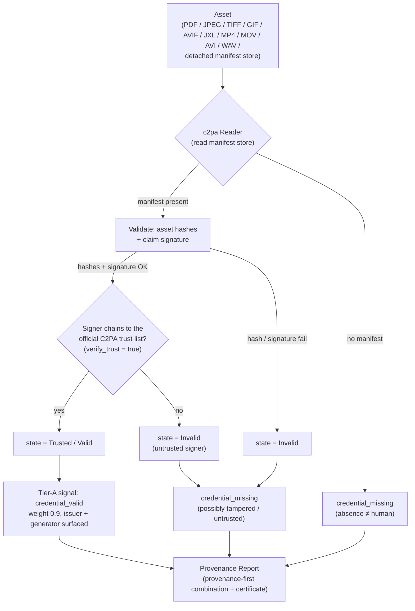

# Provenote — C2PA Validator Conformance Evidence Packet

Submitted with the C2PA Conformance Program application. Role: **Validator Product**.

**No assurance level.** Assurance levels apply only to Generator Products — corrected
2026-09-09, having previously and wrongly claimed "Level 1" here.

## 1. Product identity
| Field | Value |
|---|---|
| Product | **Provenote** — AI-content verification & provenance service |
| Role | **Validator** (reads + validates Content Credentials) |
| Version | provenance_verify 0.1.0 |
| C2PA SDK | c2pa-python 0.37.7 (c2pa-rs core 0.90.x) |
| Spec conformed to | C2PA Content Credentials 2.x |
| Owner / contact | DC — hello@provenote.us |
| Repository | github.com/cdr2265/provenote (private) |

## 2. What the product does
Provenote aggregates provenance signals over a document and issues a calibrated,
provenance-first report. The **C2PA validator** is a Tier-A signal: it reads any embedded
or detached Content Credential, cryptographically validates it, checks the signer against
the **official C2PA trust list**, and surfaces the validation state — it never treats mere
presence of a manifest as trust.

## 3. Data-flow diagram



ASCII fallback:
```
asset --> [c2pa Reader] --no manifest--> credential_missing
                |
             manifest
                v
        [validate hashes + claim signature]
                |                     \--fail--> state=Invalid --\
             pass                                                 v
                v                                        credential_missing
   [signer on official C2PA trust list?] --no--> Invalid --------/
                | yes
                v
        state=Trusted/Valid --> credential_valid (Tier A, weight 0.9)
                                          |
                                          v
                         Provenance Report (provenance-first)
```

## 4. How validation works (step by step)
1. **Read** — `c2pa.Reader` parses the manifest store from the asset (or a detached
   store). No manifest → `ManifestNotFound` → outcome `credential_missing`.
2. **Cryptographic validation** — the SDK verifies the asset hard-binding hashes and the
   claim signature (`get_validation_results()` returns per-assertion status codes).
3. **Trust** — with `verify_trust=true` and the official C2PA trust list loaded at startup
   (`configure_c2pa_trust`), the signer certificate must chain to a trust anchor. An
   untrusted signer yields `state=Invalid`.
4. **State → signal** — `get_validation_state()` / `is_valid` are mapped to a Provenote
   Tier-A `SignalResult`:
   - `Trusted` → `credential_valid`, weight **0.9**, confidence 0.99, issuer + generator surfaced.
   - `Valid` (valid but not trust-listed) → `credential_valid`, weight 0.7, with an "issuer unverified" caveat.
   - `Invalid` (hash/sig failure or untrusted) → `credential_missing`, caveat "possibly tampered".
5. **Fail-safe** — any SDK/read error is caught and returned as `error`/`skipped`; a C2PA
   failure never crashes the verification pipeline. If the SDK is absent the adapter self-skips.

Implementation: `provenance_verify/signals/providers.py::C2PAAdapter`,
`provenance_verify/c2pa_trust.py`.

## 5. Trust establishment
- Official trust list **vendored** at `provenance_verify/trust/C2PA-TRUST-LIST.pem`
  (30 anchors) and `C2PA-TSA-TRUST-LIST.pem` (22 TSA anchors), sourced from
  `github.com/c2pa-org/conformance-public/trust-list`.
- Loaded at startup via `configure_c2pa_trust()` (defaults to the vendored list; refresh
  with `scripts/update_c2pa_trust.sh`). `verify_trust=true`.

## 6. Supported asset formats
PDF, JPEG, TIFF, GIF, AVIF, JXL, MP4, MOV, AVI, WAV, and detached C2PA manifest stores
(`application/x-c2pa-manifest-store`). Text-only inputs carry C2PA via a containing asset
(e.g., a signed PDF) or a detached store.

## 7. Test evidence (reproducible)
- **Round-trip proof** — `scripts/c2pa_roundtrip.py`: signs a real asset, validates via the
  adapter → `state=Trusted, weight 0.9`; a single tampered byte → `state=Invalid`.
- **Conformance harness** — `scripts/c2pa_conformance.py`: **13/13** with the official trust
  list loaded — 4 self-generated (valid-trusted / tampered / no-manifest / no-input) plus the
  **9 official** c2pa-org/public-testfiles vectors. This is the only run that exercises the
  official vectors with trust verification **on**; the dedicated public-vectors script below
  deliberately turns it off to isolate cryptographic correctness.
- **The trust list is load-bearing** — `tests/test_c2pa_conformance.py::test_trust_list_is_load_bearing`:
  an asset signed by an off-list cert reads `state=Valid`, weight 0.7, with an explicit
  "signer is not on a trust list" caveat; add that cert as an anchor and the same asset reads
  `state=Trusted`, weight 0.9, no caveat. Both mutations that would hollow this out (equalised
  weights, `verify_trust` silently false) were shown to fail the test on 2026-09-16.
- **Official C2PA public test vectors** — `scripts/c2pa_public_vectors.py`: **8/8** from
  `c2pa-org/public-testfiles` (legacy 1.4). 4 valid provenance chains → `credential_valid`
  (state=Valid); 4 deliberately-broken error cases (E-sig / E-dat / E-uri / E-clm) →
  `credential_missing` (state=Invalid). Validated for cryptographic correctness
  (`verify_trust=false`, legacy test certs). `tests/test_c2pa_public_vectors.py` runs it in CI.
- Reproduce:
  ```
  python -m venv .venv && .venv/bin/pip install c2pa-python
  .venv/bin/python scripts/c2pa_roundtrip.py
  .venv/bin/python scripts/c2pa_conformance.py
  ```

## 8. Security & integrity
- Trust anchors are the **official C2PA list**, pinned/vendored (not fetched live in prod).
- The validator is **read-only**; it holds no signing keys.
- Provenote does not strip, weaken, or evade watermarks or credentials (see Principles).
- Generator role (future): signing uses an X.509 cert from an approved CA with the private
  key in KMS (`c2pa_signer.sign_c2pa(..., sign_callback=...)`) — out of scope for the
  validator application.

## 9. References
- C2PA Conformance: https://c2pa.org/conformance/
- Trust list: https://github.com/c2pa-org/conformance-public/tree/main/trust-list
- Open-source tools: https://opensource.contentauthenticity.org/docs/conformance/
